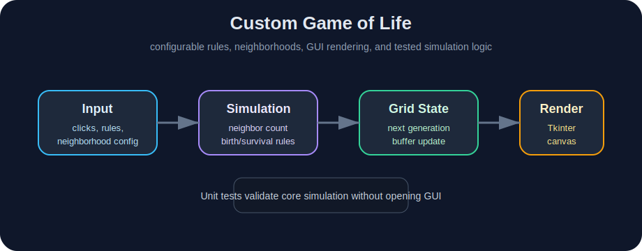

# Custom Game of Life


An interactive Python implementation of Conway’s Game of Life with customizable rules and graphical visualization.

<p align="center">
  
</p>

## Overview

This project is a modified version of the classic cellular automaton known as Conway’s Game of Life.  
Unlike the standard implementation, this version allows the user to experiment with custom birth and survival rules, neighborhood logic, and different initial configurations.

The application includes a graphical interface that makes it possible to observe how the grid evolves over time and explore how small rule changes affect the system’s behavior.

This project was created as an educational simulation and as a practical exercise in GUI development, state updates, and rule-based modeling.

## Features

- interactive graphical interface
- customizable birth/survival rules
- configurable neighborhood settings
- support for custom initial states
- real-time simulation
- step-by-step evolution of generations
- educational playground for cellular automata experiments

## How It Works

Each cell on the grid can be either alive or dead.  
At every simulation step, the next state of a cell is determined by:

- its current state
- the number of active neighboring cells
- the selected rule set

This allows the program to reproduce the classic Game of Life behavior or run many alternative rule configurations.

## Project Structure

```text
.
├── assets/         # visual documentation assets
├── game_of_life/   # core package
├── tests/          # unit tests for config and simulation logic
├── input.txt       # optional initial configuration
├── run.py          # project entry point
├── requirements.txt
└── README.md
```

## Installation

```bash
python -m venv .venv
source .venv/bin/activate
pip install -r requirements.txt
```

For Windows PowerShell:

```powershell
python -m venv .venv
.\.venv\Scripts\Activate.ps1
pip install -r requirements.txt
```

## Run

```bash
python run.py
```

or

```bash
python -m game_of_life
```

## Tests

```bash
python -m unittest discover -s tests
```

The test suite checks core simulation behavior without opening the Tkinter GUI, including stable block patterns, blinker oscillation, config parsing, and fallback rule handling.

## Continuous Integration

The repository includes a GitHub Actions workflow that installs dependencies and runs unit tests on every push and pull request to `main`.

## Educational Value

This project can be used to:

- study cellular automata
- explore emergent behavior in discrete systems
- visualize how simple local rules produce complex global patterns
- experiment with alternative rule sets beyond Conway’s original version

## What This Project Demonstrates

- Python GUI development
- implementation of rule-based simulations
- separation of model and interface logic
- work with grid state updates
- interactive visualization of dynamic systems
- automated testing of simulation logic

## Possible Improvements

- save and load predefined patterns
- support larger grids and optimized rendering
- add pattern library
- export simulation as GIF or video
- add controls for speed, reset, and presets

## Tech Stack

- Python
- Tkinter
- NumPy
- unittest
- GitHub Actions

## Notes

This repository is intended as an educational and experimental project for studying cellular automata and interactive simulations.
